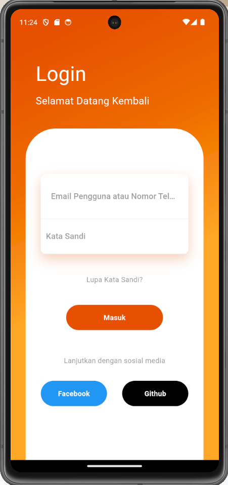
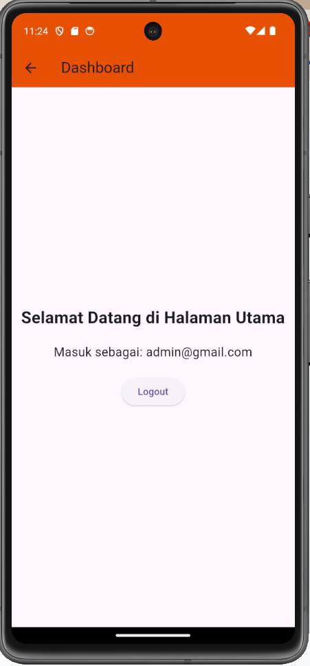
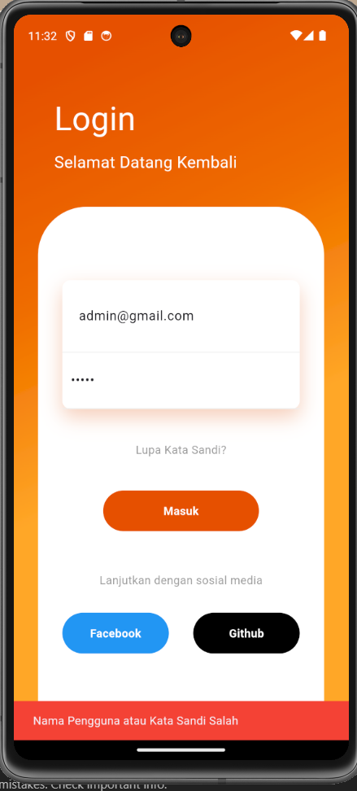

# Aplikasi Login Flutter

Aplikasi ini adalah aplikasi sederhana berbasis Flutter untuk login menggunakan nama pengguna dan kata sandi. Jika kredensial benar, pengguna diarahkan ke halaman utama. Jika salah, aplikasi akan menampilkan notifikasi kesalahan.

## Link GitHub
Untuk mengunduh atau melihat kode lebih lanjut, silakan kunjungi https://github.com/Aima07/Flutter-Login.

## Teknologi yang Digunakan
- **Framework**: Flutter
- **Bahasa Pemrograman**: Dart
- **Platform Target**: iOS & Android

## Cara Menjalankan Aplikasi

1. Clone repository dari GitHub:
git clone https://github.com/username/repo-name.git

2. Buka folder proyek:
cd repo-name

3. Jalankan perintah berikut untuk mengunduh dependencies:
flutter pub get

5. Jalankan aplikasi di emulator atau perangkat fisik:
flutter run

## Fitur Utama

- **Login Otentikasi**: Menggunakan username dan password tetap untuk login.
- **Validasi Input**: Menampilkan notifikasi jika input salah.
- **Halaman Utama (Dashboard)**: Halaman setelah login berhasil.
- **Tata Letak Responsif**: Menggunakan gradient dan card untuk tampilan modern.

## Screenshot Aplikasi

### Halaman Login

### Halaman Dashboard

### Halaman Kesalahan Login

## Struktur Kode

1. **Konstanta untuk Nama Pengguna dan Kata Sandi yang Valid**  
- `validUsername` dan `validPassword` ditetapkan sebagai variabel tetap untuk simulasi otentikasi.

2. **HomePage**
- Kelas utama yang berfungsi sebagai halaman login, menyediakan input dan tombol login.
- Mengarahkan pengguna ke `DashboardPage` atau menampilkan pesan kesalahan.

3. **DashboardPage**
- Halaman yang menampilkan pesan selamat datang setelah login berhasil.

## Catatan Tambahan
- **SnackBar** digunakan untuk menampilkan pesan error saat login gagal.
- **Navigator** digunakan untuk mengatur perpindahan halaman dari login ke dashboard atau halaman error.
